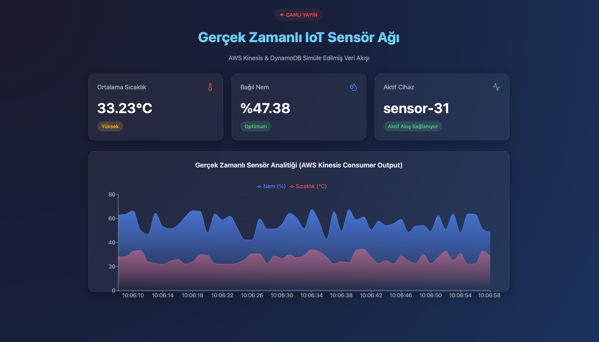

# Proje 2: Gerçek Zamanlı Veri Akışı ve İşleme (IoT / WebSocket Uygulaması)

Bu repo, "Bulut Bilişim Dersi" (3522) için geliştirdiğim ikinci projenin kaynak kodlarını içermektedir.

## Proje Kapsamı ve Hedefler

Proje kapsamında, dış ortamdan veya IoT cihazlardan gelen anlık verilerin (sıcaklık, nem vb.) gerçek zamanlı olarak toplanıp bulut tabanlı bir olay akış kanalına (AWS Kinesis) aktarılması ve ardından DynamoDB gibi bir veritabanında depolanıp istemciye (Frontend) sunulması hedeflenmiştir. 

Yönergede belirtilen **"(Sizin gerçek ortam bulma olasılığınız olmayabilir simule edeceksiniz)"** iznine istinaden, kredi kartı gerektiren premium AWS (Kinesis, DynamoDB) hesap limitlerine takılmamak adına bulut mimarisi Node.js modülleri aracılığıyla (Event-Driven) aynı mantıkla çalışacak şekilde simüle edilmiştir.

## Proje Ekran Görüntüsü


## Kullanılan Teknolojiler

- **Backend:** Node.js, Express.js
- **Aktarım Protokolü:** WebSocket (`ws` kütüphanesi). 
- **Veri Üreticisi:** Kendi yazdığım `simulator/index.js` dosyası ile 1 saniye aralıklarla rastgele sensör verisi atılır.
- **Pub/Sub Broker:** AWS Kinesis Streams mimarisi Node.js EventEmitter kullanılarak taklit edilmiştir.
- **Veritabanı:** MongoDB veya DynamoDB'yi simüle edecek şekilde, yalnızca en güncel 50 kaydı (`real-time` analize uyacak biçimde) tutan yerel NoSQL (.json) motoru kodlanmıştır.
- **Frontend / Analiz:** React.js (Vite), Recharts eklentisi.

## Klasör Yapısı

* `backend/`: Gelen WebSocket isteklerini karşılayan ve veritabanına yazan esas sunucu dosyaları.
* `backend/simulator/`: Sahte cihazdan veri basan bot yazılımı.
* `frontend/`: Akan verileri ekranda canlı (animasyonlu grafikler ve can alıcı renklerle) gösteren React projem.
* `rapor.md`: Geliştirme adımlarımı ve commit zaman çizelgemi anlattığım ilerleme raporum.

## Uygulamayı Çalıştırma (Test)

Projeyi kendi bilgisayarınızda test etmek için 3 ayrı terminal ekranına ihtiyacınız olacak:

1. **Sunucuyu Ayağa Kaldırmak:**
   ```bash
   cd backend
   npm install
   node server.js
   ```

2. **IoT Veri Akışını Başlatmak:**
   ```bash
   cd backend
   node simulator/index.js
   ```

3. **Dashboard'u (Arayüzü) Açmak:**
   ```bash
   cd frontend
   npm install
   npm run dev
   ```
